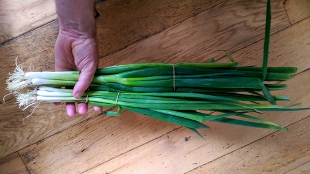
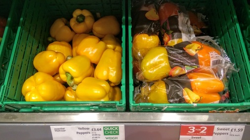

What appears to be convenience for the shopper is really slight of hand by the
producer. The producer enjoys longer shelf-life and protection during shipping
but the responsibility of disposing of the packaging is passed on to the
consumer.

## Infinity Foods
Firmly established vegetarian shop and organic advocate. Almost all of their veg
is loose and they have an excellent in-house bakery. They also sell
biodegradable [toothbrushes](https://www.brushwithbamboo.com/) and [bin
bags](http://d2w.net).

## hiSbe Food CIC (how it Should be)
The go-to place for package-free shopping. A large choice of produce in hoppers,
either take your own jars or use their paper bags. They also sell a selection of
"loose" cleaning products: washing up liquid, fabric conditioner etc., and
unpackaged soap bars.

See also [The Food Shed](http://www.foodshedbrighton.com/dry-food.html).

## Taj
All major supermarkets pack their greens in plastic but Taj offer bundles of
spinach with no packaging. They also sell lots of herbs and spices that you
often don't see loose.

You can repurpose the rubber bands from the spinach or make an awesome rubber
band ball.

They sell an interesting cheese alternative in a reusable jar: labneh. It's a
beautifully sour strained yoghurt that you can spread on your toast.

They also Vatika soap bars which come in a card box (no inner plastic bag).

## Bluebird Tea Company
A fantastic selection of loose tea and tea-supping accoutrements. 10% discount
for bringing your own pot. Smells great in there.

## La Cave à Fromage
Specialist cheese shop and very supportive of the cause.

# Mainstream supermarkets

## Waitrose (Western Road)
First things first: remember to take your [flask](images/waitrose_free_coffee)
for the free coffee.

Quite a nice illustration of the craziness of packaging! The same mushrooms
appear to be cheaper if you put them in a paper bag yourself. The paper bags can
of course also be used instead of the plastic and gel panel bags found through
the store.

You can buy two loose peppers. Or two peppers in a plastic bag.

Paper from FSC approved sources, the wrapper can go in the in-store bag
recycling.

## TK Maxx
Bamboo socks in card packaging.

