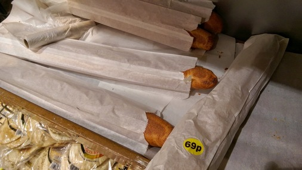
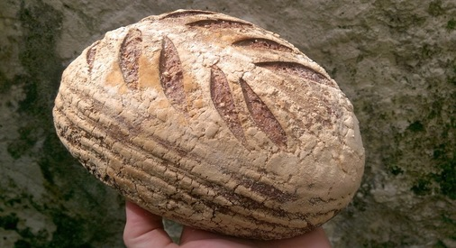

# Bread

Shop bought bread can really only come from a proper baker. In this case it's
chewy white from Real Pâtisserie.

You can also buy Real Pâtisserie bread from Taj but it mostly comes in
perforated plastic bags. Apart from the baguettes!

Cracking sea salt and rosemary sourdough from hisBe.

Deft lame work from Silo.

