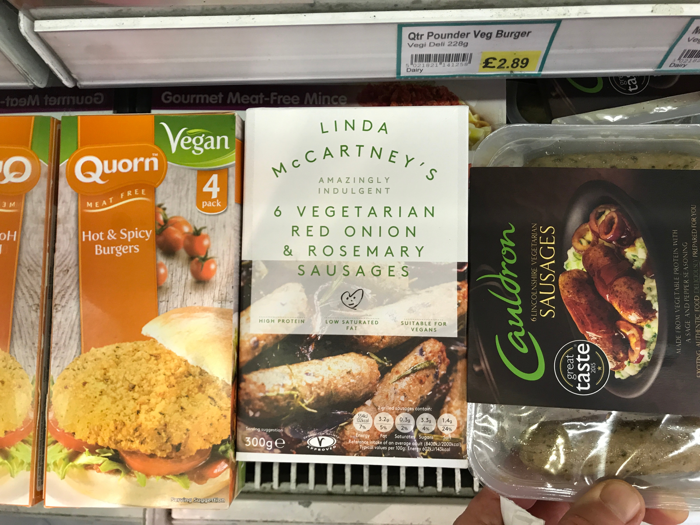

# Ready meals

The veggie ready meal section in Waitrose. Without exception each has a plastic
tray or panel.

Interestingly the frozen section has plenty of choice in simply packaged
products. We prefer a plastic panel on our fresh stuff?

## I remember when everything around here was sealed in small claustrophobic boxes
Before long all you see is plastic. Equal-portioned high-carbon footprint
produce condemned to a petrochemical tomb. As nature intended.
