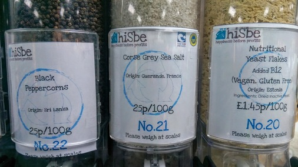
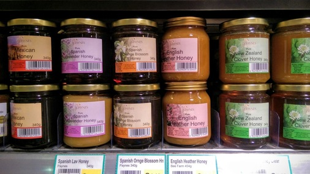
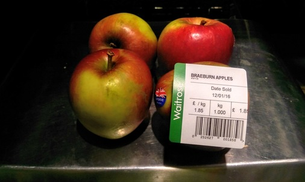
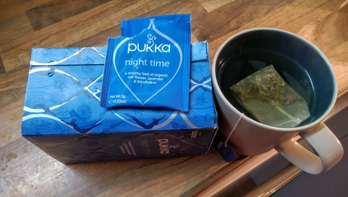

# Every day

## Sugar
I used to use Billington's for bread making but why does it only come
wrapped in plastic? Old school Tate and Lyle it is. 

Paper packaging, made in Britain: cannot argue with that.

Or just for kicks why not try coconut sugar?

## Salt
hisBe have pulled out the stops and are now enabling us to buy salt without also buying bits of plastic to pour it with.

Alternatively, Tidman's might just save the day.

http://www.maldonsalt.co.uk/Products-Tidmans-Salt.html

## Vegetable bouillon
Not something I'd even considered buying loose. hisBe are great.

## Honey

Spoilt for choice with honey. This was excellent from Surrey. So good I ate it
before I managed to take a photo.

A great selection of Payne's honey from Taj.

## Oats
The first oats I found that didn't come in a plastic bag or a box with a plastic
panel. They even suggest you compost the packet. Love Pimhill Farm!

Loose oats from hisBe are very reasonably priced and you can take your own
vessel.

I'm very fond of Wessex Mill's bread flour and just spotted their oats in Taj.

And a couple from Waitrose in paper packaging. However, if we're going to be
fussy - and we shall - they both feature an unnecessary plastic tab on the top.

## Fresh fruit
Why would you buy a net of tiny lemons from a supermarket when you could have
these beauties?

And finally some loose British apples from Taj!

Loose apples from Waitrose.

And loose French Pink Ladies from Sainsbury's Local. Expensive at £4+ per
kilo but still.

By contrast, organic apples from Waitrose. Each sealed in plastic and with a
choice of carbon footprint: Argentina, Chile or New Zealand.

## Dried fruit
A lot of things can only be found in hisBe.

Deydrated coconut

Cacao nibs

Loose plain, milk and white chocolate buttons. They're only £10/Kg too, whereas
Waitrose is at £15-20/Kg for a 100g bar of Green and Blacks. And you have to do
something with the packaging.

Dried goji berries.

Loose apricots from Taj.

Taj hack: they don't offer paper bags apart from for the takeaway curries and
the baguettes. So go and use them!

## Tea
Heath and Heather offer tea without the unnecessary paper pouches.

Failing that, Pukka do tea in wholly recyclable paper packaging.

As do Yogi. But be careful as I have seen some in plastic wrap!

And Clipper.

As an aside: all three look like they're tied shut. But the Heath and Heather
also appear to be thermally sealed suggesting a small quantity of plastic in the
paper mix.

## Newspapers
In the week newspapers are OK but inexplicably at the weekend the
food/environment pullouts come in a plastic bag.
