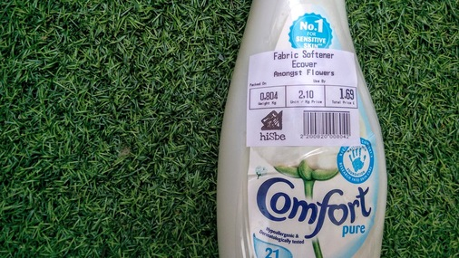
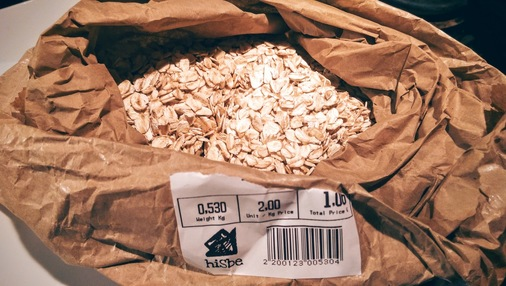
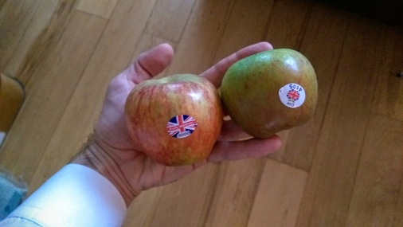
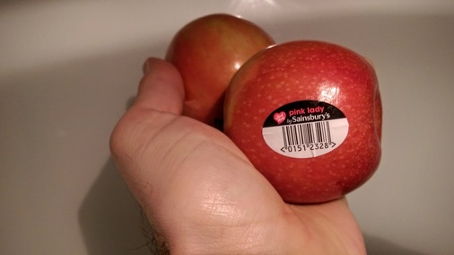
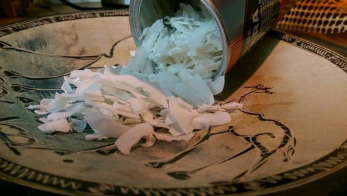
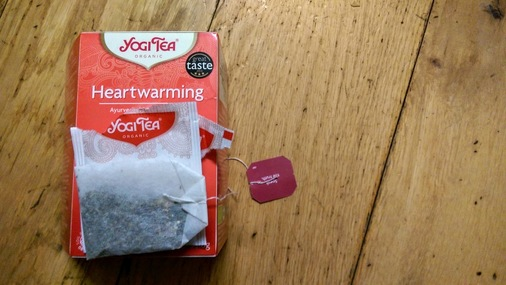

# Give me convenience...

What appears to be convenience for the shopper could actually be deft slight of
hand by the mass producer. The producer enjoy prolonged shelf-life and
protection whilst shipping and disposing of the packaging is passed on to the
consumer.

# Bread

Shop bought bread can really only come from a proper baker. In this case it's
chewy white from Real Pâtisserie. You can get Real Pâtisserie bread from Taj but
it mostly comes in perforated plastic bags. At a push you could buy buns from
Waitrose and put them in the plain paper bags from the mushroom section rather
than those with the plastic panel.

Apart from baguettes! You can also use the spare paper bags for other groceries rather
than the plastic ones.

Cracking sea salt and rosemary sourdough from hisBe. Wow! 

Deft lame work from Silo.

# Bottle-cutting

Plant pots made with a Kinkajou bottle cutter.

# Changes

Changes we've made since meeting [Silo](http://www.silobrighton.com/)/[Trash is for
Tossers](http://www.trashisfortossers.com/)/[Alchemy
Flow](https://www.facebook.com/AlchemyandFlow/):

# Homemade food/drink
* Bread
* Kimchi/sauerkraut
* Milk kefir
* Soft cheese
* Home brew beer and wine

# Packaging

* Upcycled glasses by bottle cutting ([Kinkajou](http://www.bottlecutting.com/))
* Buying loose where possible ([hisBe](http://hisbe.co.uk/))
* Refusing products with non-recyclable packaging
* Stopped buying energy gels/sports supplements
* Kept a zero waste pot at work

# Foraging
* Interest in mushrooms (too soon to pick)
* Gathering easy plants (herbs, wild garlic)

# Cleaning

## Toothbrushes

A few biodegradable toothbrushes have started to appear.

https://www.brushwithbamboo.com/

## Cleaning products

Lots of options for buying soap without packaging but this is by Faith In
Nature and smells of rosemary. Bought from hisBe.

And a Vatika bar from Taj wrapped only in cardboard.

Loose fabric conditioner from hisBe:

## Toilet paper

Paper from FSC approved sources, plastic in the Waitrose carrier bag recycling.

And more recently, toilet roll made from recycled paper.

# Condiments

## Sugar
I used to use Billington's for bread making but why does it only come
wrapped in plastic? Old school Tate and Lyle it is. 

Paper packaging, made in Britain: cannot argue with that.

Or just for kicks why not try coconut sugar?

## Salt
hisBe have pulled out the stops and are now enabling us to buy salt without also buying bits of plastic to pour it with.

Alternatively, Tidman's might just save the day.

http://www.maldonsalt.co.uk/Products-Tidmans-Salt.html

## Vegetable bouillon
Not something I'd even considered buying loose. hisBe are great.

# Honey

Spoilt for choice with honey. This was excellent from Surrey. So good I ate it
before I managed to take a photo.

A great selection of Payne's honey from Taj.

# Oats
The first oats I found that didn't come in a plastic bag or a box with a plastic
panel. They even suggest you compost the packet. Love Pimhill Farm!

Loose oats from hisBe are very reasonably priced and you can take your own
vessel.

I'm very fond of Wessex Mill's bread flour and just spotted their oats in Taj.

And a couple from Waitrose in paper packaging. However, if we're going to be
fussy&mdash;and we shall&mdash;they both feature an unnecessary plastic tab on the top.

# Dairy

## Cheese
Where can you buy cheese without any packaging? Tricky. La Cave à Fromage in
Hove is the answer. They're very accommodating and let me use my own box for my
delicious [Mayfield
Swiss](https://www.cookipedia.co.uk/recipes_wiki/Mayfield_Swiss_cheese), a
vegetarian mountain cheese made in Sussex. 

And here's some Labneh (curd/yoghurt) in a reusable jar from Taj.

# Fermentation

All these recipes use a percentage of salt. If 1.6% salt is required, 1000g of
veg would need 16g of salt. But you should always taste the raw mix anyway. 1.6%
is the minimum I've gotten away with and experienced no spoiling. But this is in
my climate (southern UK) and my house.

## Basic principles of fermented cabbage

Shop bought fermented goods are pretty pricey considering it's mostly cabbage.
But it's really easy to get involved.

There's plenty of shop-bought kimchi in Brighton but very few in eco-friendly
packaging. So why not make your own?

- 100% red cabbage (loose, Infinity Foods)
- 25% wild garlic (wild, The Downs)
- 1.6% salt
- 1% red chilli (loose, Taj)

Chop everything and mix in the salt. Crush with your hands to get the juices
flowing (if it's a particularly tough cabbage you might need to use a pestle).
Leave for ten minutes and repeat until there's a good amount of liquid in the
bottom of the bowl.

Pack into a glass jar leaving about 20% expansion space and close the lid.

Keep out of the sunlight, it should start to bubble by day two. Taste it after a
week. Is it delicious? If so, eat on homemade bread with aioli. 

The flavour profile evolves over the course of a few weeks. If you manage to not
eat it all you'll notice the taste drops off after a few weeks. If you really
like the taste on a certain day move it to the fridge to slow it down.

## Fermented salsa

A very quick ferment that goes with anything.

- Two large tomatoes, coarsely chopped
- Half as much onion as toms, 5mm dice
- Two garlic cloves, finely chopped
- A few radishes, finely sliced
- One red chilli, finely sliced

The denser the vegetable the finer it needs cutting.

Put it all into a mixing bowl on a scale, add 1.6% of the weight of the veg in
salt. Mush it between your fingers until mixed and quite liquid. Add to a jar,
almost to the brim, pop the lid on and leave in a dark cupboard for up to a
week. You can put it in a fridge if you like but the acidity should stop
anything untoward occurring.

Put everything in a mixing bowl on a scale, add 1.6% of the weight of the veg in
salt. Mush it between your fingers until mixed and quite liquid. Taste and then
dd to a jar, almost to the brim, pop the lid on and leave in a dark cupboard for
up to a week. You can put it in a fridge if you like but the acidity should stop
anything untoward occurring.

## Okraut

A experiment to see how okra behaves. The addition of okra makes it quite slippery! So possibly not for everybody. But
still.

# Beer and wine
[Bison Brewery](http://bisonbeer.co.uk/) sell large refillable bottles of
beer affectionately known as "growlers" from their shop on East Street. If
purchasing beer from a supermarket then don't choose those with six-pack rings.
Ten packs come in a cardboard box with no plastic. Or go to the pub. Or brew
your own!

# Bottle cleaning
Use an abrasive like old rice and a few drops of washing up liquid.

See mowerdog's [video](https://www.youtube.com/watch?v=HzPQDWTMAVQ).

# Fruit

## Fresh fruit
Why would you buy a net of tiny lemons from a supermarket when you could have
these beauties?

And finally some loose British apples from Taj!

Loose apples from Waitrose.

And loose French Pink Ladies from Sainsbury's Local. Expensive at £4+ per
kilo but still.

By contrast, organic apples from Waitrose. Each sealed in plastic and with a
choice of carbon footprint: Argentina, Chile or New Zealand.

## Dried fruit
A lot of things can only be found in hisBe.

Deydrated coconut

Cacao nibs

Loose plain, milk and white chocolate buttons. They're only £10/Kg too, whereas
Waitrose is at £15-20/Kg for a 100g bar of Green and Blacks. And you have to do
something with the packaging.

Dried goji berries.

Loose apricots from Taj.

Taj hack: they don't offer paper bags apart from for the takeaway curries and
the baguettes. So go and use them!

# Marinade
* Ginger
* Garlic
* Rice wine vinegar
* Sésame oil

* Lemon
* Garlic
* Chilli
* Parsley
* Oregano
* Cayenne pepper
* Sherry vinegar
* Truffle oil

* Bay
* Salt
* Olive oil
* Roasted paprika

# Ready meals
The veggie ready meal section in Waitrose. Without exception each has a plastic tray or panel.

Interestingly the frozen section has plenty of choice in simply packaged
products. We like the plastic panel on fresh products?

# Newspapers
In the week newspapers are generally OK but at the weekend the food/environment pullouts must come in a plastic bag for convenience.

# Precious Plastic
Small scale plastic processing kits. The future!

http://preciousplastic.com/

# Water
We're fortunate enough to have a good supply in Brighton so it's difficult to
justify bottled water. But it is of course treated. If you're concerned about
chlorination for general consumption or home baking then it can be left to stand
or boiled.

Infinity Foods stock *Life* refillable bottles if you'd rather have mineral
water: "which is sourced from springs on certified organic land in
Pembrokeshire."

For some bottle facts see [Ban the
Bottle](https://www.banthebottle.net/bottled-water-facts/). And see how
[Southern Water](https://www.southernwater.co.uk/water-treatment) treat what
comes out of our taps.

# I remember when everything around here was sealed in small claustrophobic boxes
Before long all you see is plastic. Equal-portioned high-carbon footprint
produce condemned to a petrochemical tomb. As nature intended.

# Trash is for tossers
Great dinner and chat with zero waste luminaries Douglas McMaster (Silo
Brighton), Tom Griffiths (Flank) and Lauren Singer.

- http://www.trashisfortossers.com/
- http://www.silobrighton.com/

# Articles
* http://www.independent.co.uk/news/world/americas/plastic-rubbish-tide-caribbean-island-roatan-honduras-coast-pollution-a8017381.html

# Mid-year review

What's the best way to assess your plastic usage? Keep all of it.

Pledge to keep everything that is neither biodegradable nor recyclable in your
area or office. A nice idea is to fill a jar and see how long it takes to fill
it. It makes it all the more horrifying when you have to thrown it away in bulk,
knowing that it's destined for the landfill.

It also makes you consider how much you want that bag of crisps knowing that the
bag will be hanging around for decades. Conveniently, processed food usually
comes in plastic so it makes it quite easy to avoid.

## 2017 - 2

* Karg's wrappers and ties
* Crisp packets
* Sweet wrappers
* Blister packs
* Coffee lid
* Quorn sausage roll packet
* Chocolate bar foil
* Coffee machine cups (damn machine occasionally ignores my mug!)

## 2017 - 1

* Karg's wrappers
* Roasted fava beans
* Cracker box
* Crisps
* Blister pack
* Apple stickers
* Coffee lids
* Quorn sausage roll
* Chocolate bar foil

## 2016 - 2

* Tin foil from chocolate bars and breakfast roll
* Fruit trays
* Apple stickers
* Coffee lids
* Bike light/shirt packaging
* Vitamins and medicine In blister packs
* Assorted plastic bags (mostly fruit and bread)
* Foil wrappers from crisps, seeds and chocolate

## 2016 - 1

# Natto
Biggest tip is to make sure the soybeans are very well cooked. Almost over
cooked. Once the soybeans are easily squished between your fingers and the color
turns from yellow to brown you are good! I use a sous vide bath to incubate. 44C
so the soybeans are right at 38C. Use about 5-10% store bought natto to freshly
cooked natto. Keep the beans at about an inch or so when incubating. I use a
high tech methods to keep things as consistent as possible as some people buy
from me. I prefer to pressure steam my beans. I also add 1tbsp baking soda to 2L
of filtered water. This reduces cooking time quite a bit. I use the double film
method with holes in the film. Good luck!

Lance HancherowGroup moderator Same as Phil Kuehnl does them.... I pressure
steam them... otherwise it is way too frustrating, and I would have quit making
it years ago doing it the old traditional way to cook the beans! lol ;) p.s. I
use zip lock baggies with pinholes in them to pack them in for incubation in
around a 1/2 to 1 inch layer.

Phil Kuehnl Incubating is a matter of preference. Lance uses high tech bags and
I use plastic containers. My set up is similar to how you buy the natto at the
store. I put holy film on top of the natto (barely touching it.) creating a very
humid environment. Then another layer of holy film on top of the container.
# Readme

Image by [Plastic Soup Foundation](https://www.facebook.com/PlasticSoupFoundation/).

- [Mid-year review](myr.md)
- [Sport](sport.md)
- [Recycling](recycling.md)
- [Recipes](recipes.md)
- [Baking](baking.md)
- [Fruit](fruit.md)
- [Cleaning](cleaning.md)
- [Shops](shops.md)
- [Dairy](dairy.md)
- [Veg](veg.md)
- [Tea](tea.md)
- [Condiments](condiments.md)
- [Fermentation](fermentation.md)
- [Changes](changes.md)
- [Bottle cutting](bottle-cutting.md)
- [Animal welfare and passive aggression](welfare.md)
- [Zero waste shopping](zero-waste-shops.md)
- [Misc](misc.md)

# Granola
I've been thinking about this granola for a while and finally found some dried
fruit that doesn't come in a plastic bag. It's basically 300g of oats and then
60g of anything else you have to hand.

__From hiSbe Food CIC (loose):__

- 300g large oats
- 60g cacao nibs
- 60g dried goji berries

__From Waitrose:__

- 60g Silverspoon UK-grown caster sugar (paper bag)

__From Adam the apiarist - Surrey Honey (glass jar):__

- 60g Surrey honey

__From Taj (glass jar)__

- 60g coconut oil

Combine everything bar the berries (lest they burn), spread on a tray and cook
at 200C for 8 minutes until brown (give it a stir around halfway through). I
tend to chuck the berries on top when it comes out of the oven.

Actually you can chuck just about anything in and 60g seems a good proportion. I
try not to make it too much about seeds but hemp and flax make an interesting
addition. And if you're feeling flush you can omit the sugar and double up on
the honey. I have tried olive oil when I've run out of coconut but it seems to
catch (burn) very easily. Keep an eye on it.

Once you're happy with it check your Twitter for a while whilst it cools and
transfer to an airtight container. This does keep it nice and crisp but we're
all busy people and it will keep quite happily for a week covered with another
baking tray.

Starting with 300g of oats makes one baking tray's worth. I tend to do two at
once, the lower one stays in for the first eight minutes, stir and then I bring
it to the top for a further four minutes.

# Epic cheese sandwich

- Bread, Silo
- Smoked cheddar, La Cave à Fromage
- Spinach, Taj
- Tomatoes, The Open Market
- Harissa and mayonnaise in glass jars (no plastic seal), Waitrose

## Waste
- Two paper bags to recycle/reuse 
- Two rubber bands to repurpose
- Stalks in the Nutribullet
- Roots and vines in the compost

# Recycling

## Which types of plastic can be recycled?
From [Brighton and Hove recycling
FAQ](http://www.brighton-hove.gov.uk/content/environment/recycling-rubbish-and-street-cleaning/recycling-faqs)

## Bottle recycling in Brighton
Plastic bottles are the only plastics that Brighton & Hove and many other local
authorities currently recycle. Plastic bottles are mainly made from PET plastic
(soft drinks and water bottles) and HDPE (milk and detergent bottles). There are
already markets for plastic bottles as these can be recycled back into bottles
or even fleeces!

There are several reasons why other plastics are not currently being recycled.
These include:
- There are not well developed and secure markets for all plastics. This means
  we may not be able to sell them on.
- Even though some items such as food trays might be made from PET, they have
  different properties than the PET used to make bottles. This means we may not
  be able to process the material.
- Plastics are used to make food trays and there is a concern that residents
  might place trays out for recycling that still contain food. If too much
  recycling becomes contaminated, it cannot be processed.

## Lids
> Yes as the lids are made from different plastics so can contaminate the
> recycling. Please wash and squash your plastic bottles and put them in your
> recycling box without lids. 

And come contradictory advice from Twitter:

> BHCC_Cityclean (@RecyclingRefuse) Jan 7 2016, on communal recycling bins:
>  If you're removing plastic lids from glass bottles, just unscrew the top and
>  leave the ring attached to the bottle. You can cut them off if you really
>  want to remove them. Plastic bottles can have them left on. Ryan.

# Soya milk and Tetra Pack recycling
Couldn't find the Tetra Pack recycling point on the [council website](http://www.brighton-hove.gov.uk/content/recycling-bins-map) but it's [here](https://www.google.co.uk/maps/@50.8285584,-0.1377455,3a,15y,296.01h,78.37t/data=!3m6!1e1!3m4!1swEfHWdBDEH__9ClosMu0Vg!2e0!7i13312!8i6656?hl=en). Magpie might collect them too.

Alpro and granaVita have slightly fewer components: some of them have an extra plastic bung. 

And Bonsoy has no plastic bits... yey! (But it is twice the price.)

# Refuse collection
It's easy to forget how convenient it is for somebody else to sort your rubbish
out for you. Brighton during the bin strike, June 2013. 

# Plastic bags

It goes without saying: no plastic bags. Ever! People argue that they reuse
them, but how many times must they be reused to justify the decades they will be
hanging around afterwards? Must they be handed down to their children to offset
the manufacturing cost and environmental impact? Even official bags-for-life are
unlikely to last for the duration of your lifetime as claimed. But a cotton bag
will at least have a chance of decomposition when it has reached the end of its
useful life.

The answer can only be to not use plastic bags at all. See [this
article](http://www.wsj.com/articles/SB122238422541876879) in the Wall Street
Journal.

Various Twitter chat about plastic bags:

__Waitrose__

Dean Turbo @deanturbo  Jan 3 2016:

"@waitrose hi! Can beercan plastic rings go in with the plastic bag recycling?
And are they sorted manually when they leave the store?"

Waitrose @waitrose  Jan 3 2016:

"@deanturbo I'm afraid not - only plastic bags and film displaying the OPRL logo
can be recycled"

On-Pack Recycling Label: http://www.oprl.org.uk/

__Sainsbury's__

Dean Turbo @deanturbo  Jan 12 2016:

"@sainsburys Hi! Just noticed the 5p bags don't have the OPRL logo on them. Does
this mean they can't be recycled in store?"

Sainsbury's @sainsburys  Jan 12 2016:

"@deanturbo Hi Dean, they're made of recycled material and are recyclable, we'll
replace them free of charge if they become damaged." 

And here are some biodegradable bin bags from Infinity Foods. See
[d2w](http://d2w.net).

## Alternative recycling companies
* http://www.magpie.coop/services/greenbox

# How long until it's gone?

# Shops

## hiSbe Food CIC
So many loose products that you can only buy in hisBe.

## Infinity Foods (vegetarian)
Long-established vegetarian supermarket.

# Restaurants

## Silo
Zero-waste restaurant/cafe/coffee. Not vegetarian but increasingly
plant-focused. Notably their in-house composter (which actually lives in the
restaurant) has such an appetite that they also take in waste from the
surrounding businesses.

## Burger Brothers
Burger specialists and they use reassuringly biodegradable boxes.

# Sport

## Energy gels
Gels are the scourge of the countryside. I find it baffling that people just
throw the clearly non-biodegradable foil away. Instead of these I fill my water
bottle with sugar and fruit tea (if I'm feeling that way). Not quite the hit of
a gel but I can't justify such waste as a weekend athlete.

## Bike clips
Old school "trouser bands" rather then the cooler snappy things that are made
from bits of plastic and self-destruct after a couple of months.

Edit: but they're not very good! Will try them again.

## Snacks
Pop some loose apricots from Taj in your jersey.

# Tea, please...
A goodly selection of loose tea and tea-supping accoutrements from Bluebird Tea Co. and 10% discount for bringing your own pot.

Heath and Heather offer tea without the unnecessary paper pouches.

Failing that, Pukka do tea in wholly recyclable paper packaging.

As do Yogi. But be careful as I have seen some in plastic wrap!

And Clipper.

As an aside: all three look like they're tied shut. But the Heath and Heather
also appear to be thermally sealed suggesting a small quantity of plastic in the
paper mix.

# Veg

## Loose peppers
In Waitrose you can buy two loose peppers. Or two peppers in a plastic bag. 

## Lemongrass
A nice bit of lemongrass from Taj.

You can repurpose the bands or make an awesome rubber band ball!

## Sandwich greens
All major supermarkets pack their greens in plastic so they're out. However, Taj
do bundles of spinach with no packaging; we just need to juice the stems, compost the
roots and put the rubber bands to good use.

Proper spring onions from Taj!

# Zero-waste-shops

Places that encourage no packaging:

* [The Food Shed](http://www.foodshedbrighton.com/dry-food.html)
* hisBe
* Taj
* Infinity Foods

# Waitrose

Quite a nice illustration of the craziness of packaging! The same mushrooms
appear to be cheaper if you put them in a paper bag yourself.

Remember to take your flask for the free coffee.

# Animal welfare and passive aggression (skip if not important to you)

## "We are evolved to eat meat"
We have evolved *to be able* to eat animals. But does that mean it's good for
us? And the planet? We could exist by eating only puffins but would we be
healthy? Equally we can live perfectly happily on plants.

## "Drinking cows' milk is unnatural"
We can only consume our own species?

## "I only eat animals that have been looked after"
But does it matter? You're still slaughtering and eating them. Is this for your
benefit or the animal?

## "I'm an animal lover [but I'm not a vegan]"
How can you love animals and eat _any_ of them? You love consuming animals? You
love _some_ animals and eat the rest?

## "I just want to help the animals [but I'm not a vegan]"
You just want to help them into your belly! How can that not be hypocritical?
You just want to help *some* of the animals.

## "I eat cows but eating dogs is wrong"
What's acceptable to eat is, of course, completely arbitrary and driven by
culture and religion.

Is it size? I don't think so: cows are good (unless you're Hindu), horses bad.

Is it intelligence? No, pigs are pretty smart.

Is it scarcity? Still no. Tigers bad, cod fine.

Is it cuteness? Absolutely not. We eat tonnes of lamb but foxes go untouched.
(Bar the sport.)

## "Animals are there for us to eat"
For survival, perhaps. But we grow plants to mass produce animals. If they're
ours to eat why stop at one level of indirection? Why not fell forests to grow
soy to raise cattle to rear crocodiles and then eat the crocodiles? Perhaps
soy-fed cow crocs are tastier than grass-fed cattle?

Or we could just eat the soy and live perfectly healthy lives without killing
anything.

# To sort

Glass jars are good!

Bamboo socks.

